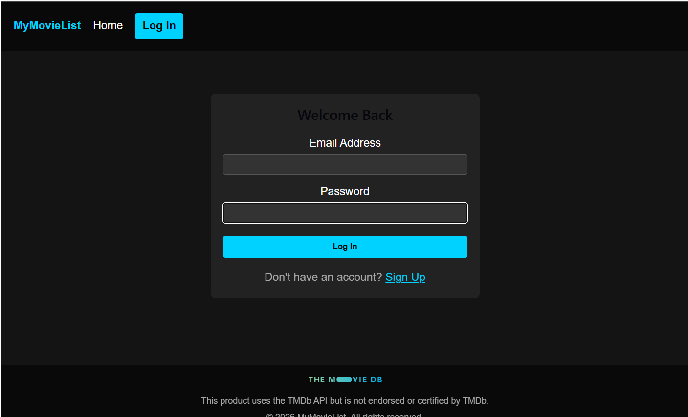
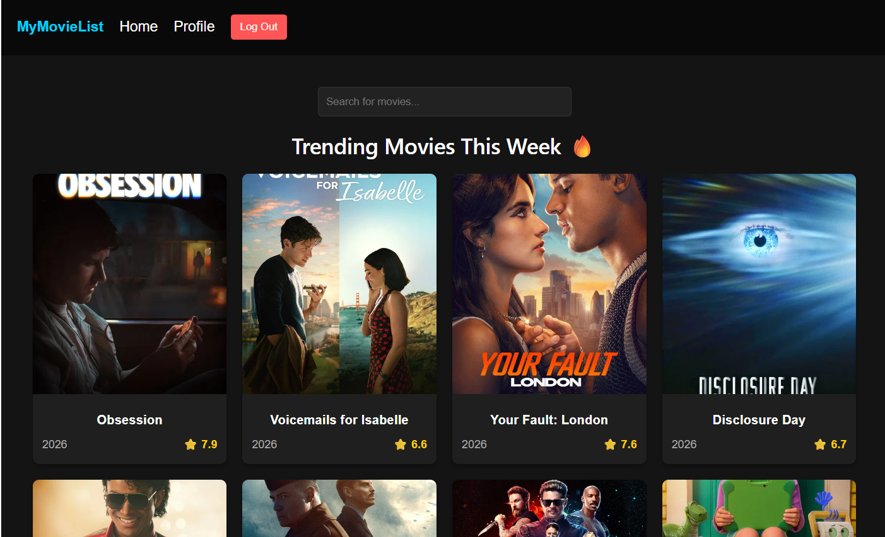
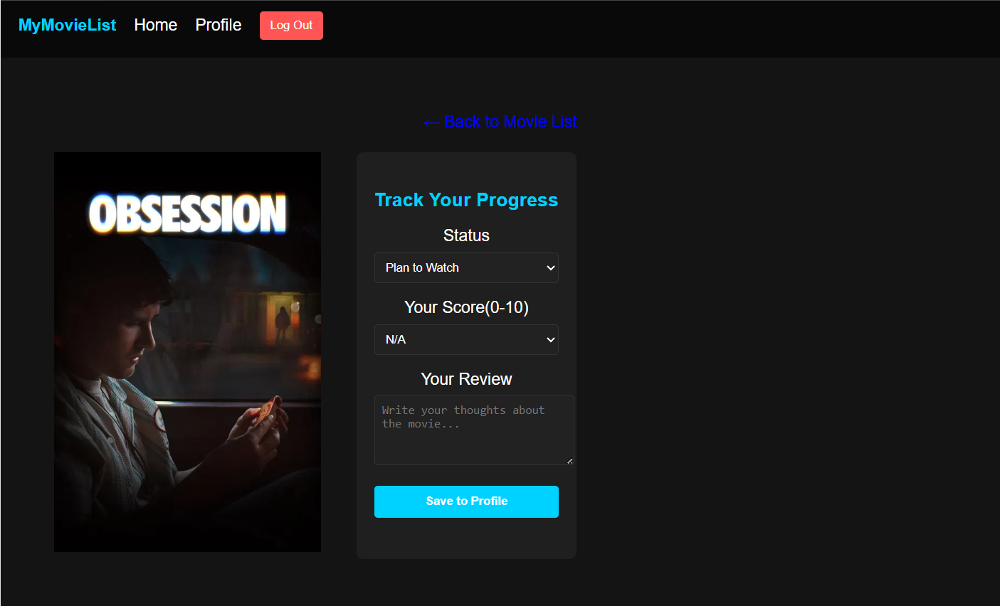
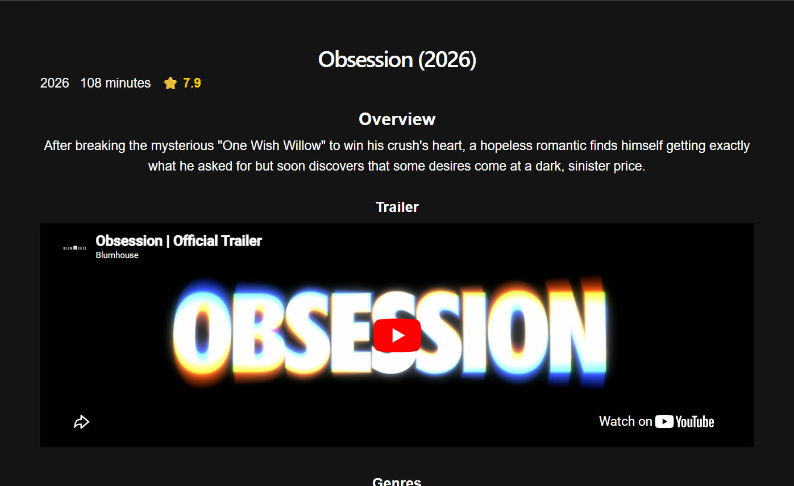
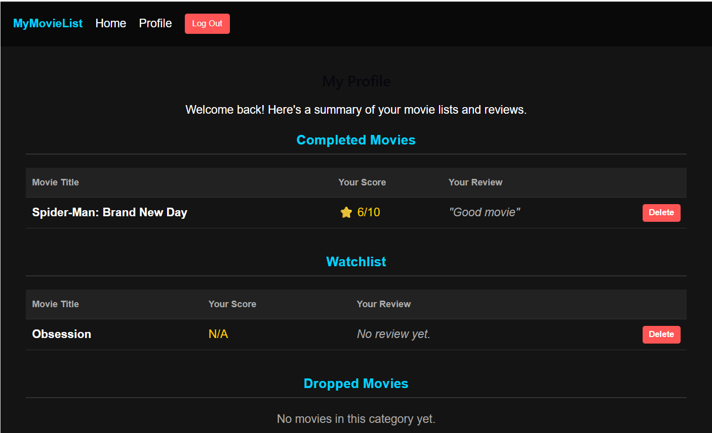

# MyMovieList

MyMovieList is a full-stack movie tracking application inspired by Letterboxd and MyAnimeList. It allows users to discover trending movies, search for specific titles, and maintain a personalized profile by categorizing movies into "Completed", "Watchlist", or "Dropped" lists, complete with personal ratings and reviews.

## Features
- User Authentication: sign-in and login powered by Supabase Auth.
- Real-Time Search: Implemented a debounced search bar that searches movies with a 500ms delay to avoid excessive API calls.
- Movie Detail Pages: overview, genres, runtime, rating, and top 5 cast members.
- Progress Tracking: log each movie as Plan to Watch, Completed, or Dropped.
- Personal Scores and Reviews: rate movies 0–10 and write your own review.

## Tech Stack
- Frontend: React (Vite), React Router v6
- Backend: Supabase (PostgreSQL)
- Authentication: Supabase Auth
- External API: The Movie Database (TMDB) API
- Styling: Inline styles

## Screenshots



 




## Running The Project

### Prerequisites

In order to get the project running locally, you will need:
- Node.js (v16+) installed on your machine
- A free API key from [TMDB](https://www.themoviedb.org/settings/api)
- A free [Supabase](https://supabase.com) account

### Setup Instructions

1. **Clone the repository:**
   ```bash
   git clone <your-repo-url>
   cd mymovielist
   ```

2. **Install dependencies:**
   ```bash
   npm install
   ```

3. **Set up environment variables:**
   Create a `.env.local` file in the root directory and add:
   ```
   VITE_SUPABASE_URL=your_supabase_url
   VITE_SUPABASE_ANON_KEY=your_supabase_anon_key
   VITE_TMDB_API_KEY=your_tmdb_api_key
   ```

4. **Run the development server:**
   ```bash
   npm run dev
   ```
   

5. **Build for production:**
   ```bash
   npm run build
   ```

## Project Structure

```
src/
├── pages/           # Page components (Home, Login, MovieDetails, Profile)
├── App.jsx         # Main app component and routing
├── main.jsx        # Entry point
├── supabaseClient.js # Supabase configuration
└── assets/         # Static assets
```

## How It Works

1. **Authentication:** Users sign up or log in using Supabase Auth
2. **Discovery:** Browse trending movies or search by title
3. **Tracking:** Add movies to your Completed, Watchlist, or Dropped lists
4. **Reviews:** Rate movies and write personal reviews
5. **Profile:** View and manage your movie collection


